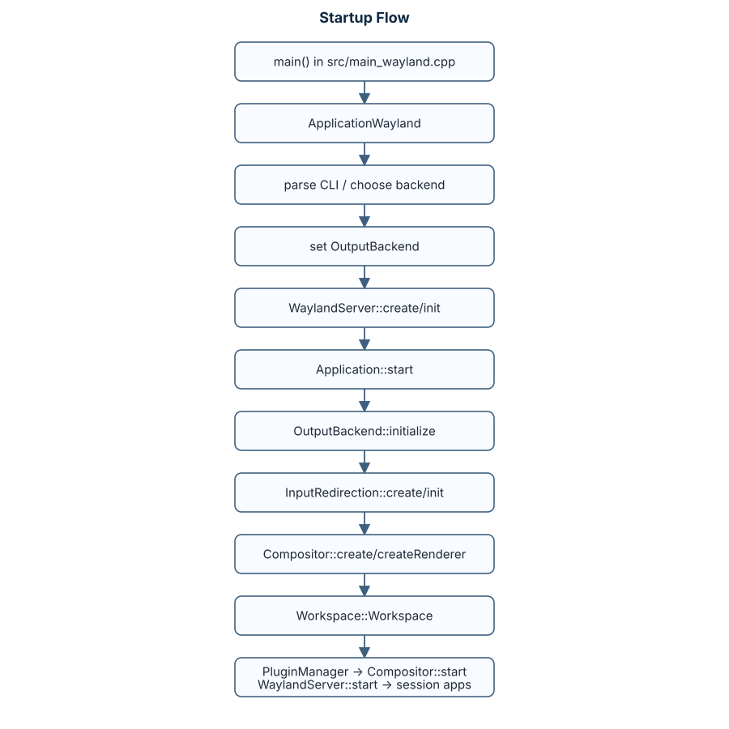
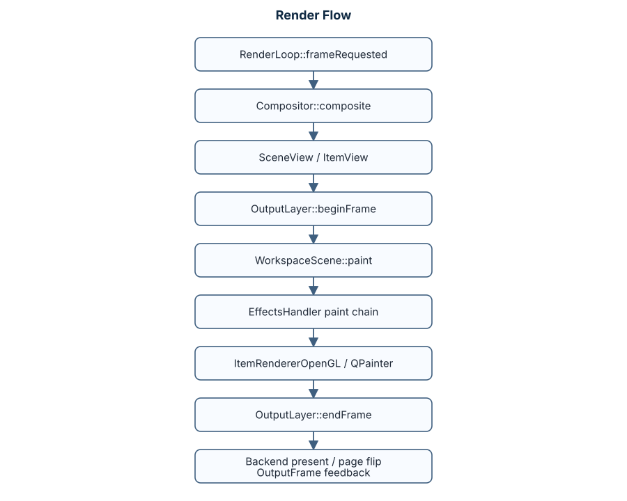
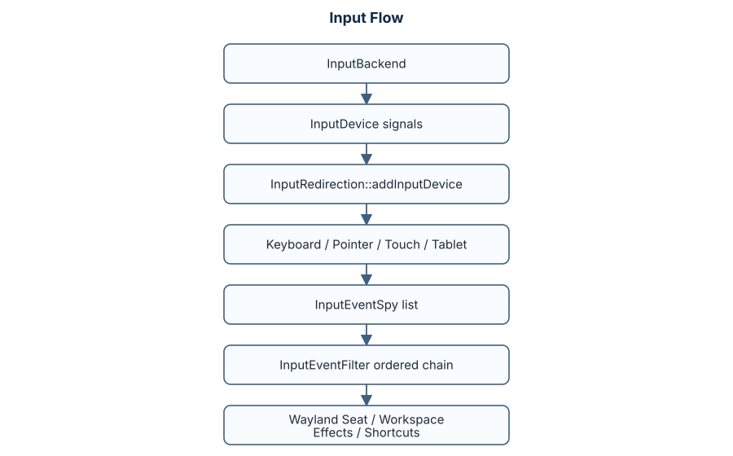
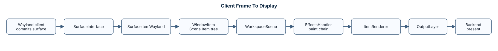
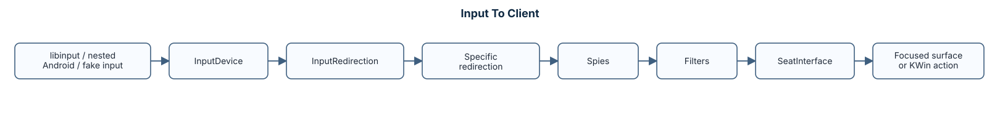
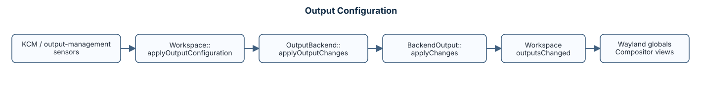

# KWin Architecture Notes

本文基于当前 `Plasma/6.6` 分支源码整理，重点描述代码结构、运行时对象关系和主要数据流。

## 项目定位

KWin 是 KDE Plasma 使用的 Wayland compositor / window manager。当前仓库构建两个核心产物：

- `kwin`：共享库，包含窗口管理、Wayland 协议服务、输入、渲染、插件、脚本等主体逻辑。
- `kwin_wayland`：Wayland 会话入口，可选择 DRM、嵌套 Wayland、嵌套 X11、Virtual 后端启动。

顶层构建入口是 `CMakeLists.txt`，核心源码入口是 `src/CMakeLists.txt`。

## 顶层目录

| 路径 | 作用 |
| --- | --- |
| `src/` | KWin 主实现。 |
| `src/core/` | 后端无关的输出、渲染循环、buffer、色彩、session 抽象。 |
| `src/backends/` | 平台后端：DRM、Wayland、X11 windowed、Virtual、Android、libinput/fakeinput。 |
| `src/scene/` | scene graph、Item 树、渲染视图、OpenGL/QPainter item renderer。 |
| `src/wayland/` | Wayland server protocol wrappers 和协议实现。 |
| `src/xwayland/` | Xwayland 启动、X11 bridge、DND/data bridge、X11 event 接入。 |
| `src/effect/` | Effect API、EffectHandler、效果渲染链。 |
| `src/plugins/` | 内建效果、服务插件、QPA 插件、screencast、nightlight 等扩展。 |
| `src/scripting/` | JS/QML 脚本运行时和暴露给脚本的 Workspace API。 |
| `src/kcms/` | 系统设置模块。 |
| `autotests/` | 单元测试、Wayland server/client 测试、集成测试。 |
| `tests/` | 手工/辅助测试程序。 |
| `doc/` | 用户文档、测试说明、编码约定、色彩管理说明。 |

## 核心对象

| 对象 | 文件 | 责任 |
| --- | --- | --- |
| `ApplicationWayland` | `src/main_wayland.*` | 解析命令行，选择输出后端，创建 `WaylandServer`，驱动启动顺序。 |
| `Application` | `src/main.*` | 持有全局配置、`OutputBackend`、`Session`、`PluginManager`、`InputMethod`。 |
| `OutputBackend` | `src/core/outputbackend.h` | 平台后端抽象，创建 input/render backend，暴露物理输出。 |
| `BackendOutput` | `src/core/backendoutput.h` | 后端输出抽象，包含模式、缩放、变换、色彩、亮度、DPMS、render loop。 |
| `LogicalOutput` | `src/core/output.h` | Workspace 使用的逻辑输出，负责全局坐标和输出本地坐标映射。 |
| `RenderLoop` | `src/core/renderloop.h` | 每输出的合成调度器，发出 `frameRequested`，记录 present 时间。 |
| `Compositor` | `src/compositor.*` | 选择 OpenGL/QPainter backend，创建 `WorkspaceScene`，按 render loop 合成。 |
| `RenderBackend` | `src/core/renderbackend.h` | 渲染后端基类，暴露 compatible output layers、buffer import、graphics reset。 |
| `OutputLayer` | `src/core/outputlayer.h` | 输出 plane/layer 抽象，支持 primary、cursor、overlay、direct scanout。 |
| `Workspace` | `src/workspace.*` | 窗口管理中枢：窗口列表、焦点、堆叠、虚拟桌面、输出布局、规则、快捷键。 |
| `Window` | `src/window.*` | 所有可管理窗口的基类，Wayland/X11/Internal window 共享状态和操作。 |
| `WaylandServer` | `src/wayland_server.*` | Wayland display、seat、协议全局对象、surface 到 `Window` 的注册。 |
| `InputRedirection` | `src/input.*` | 输入设备汇聚、事件 spy/filter 链、转发到 seat/window/effects/global shortcuts。 |
| `EffectsHandler` | `src/effect/effecthandler.*` | 效果生命周期、paint hook 链、Effect API 暴露。 |
| `PluginManager` | `src/pluginmanager.*` | 从 `kwin/plugins` 加载二进制插件。 |

## 启动流程



关键顺序在 `ApplicationWayland::performStartup()`：

1. `createOptions()`
2. `outputBackend()->initialize()`
3. `createInput()`
4. `createInputMethod()`
5. `createTabletModeManager()`
6. `Compositor::create(); createRenderer()`
7. `createWorkspace()`
8. `createPlugins()`
9. `compositor->start()`
10. `waylandServer()->start()`
11. 可选启动 Xwayland 和 session/applications

## 后端选择

`kwin_wayland` 当前在 `src/main_wayland.cpp` 根据命令行和环境选择：

- `--drm` 或默认无嵌套环境：`DrmBackend`
- `--wayland-display` 或 `WAYLAND_DISPLAY`：`WaylandBackend`
- `--x11-display` 或 `DISPLAY`：`X11WindowedBackend`
- `--virtual`：`VirtualBackend`

后端共同实现 `OutputBackend`：

- `initialize()`：枚举/创建输出。
- `createInputBackend()`：创建 libinput、嵌套 Wayland input、Android input 等。
- `createOpenGLBackend()` / `createQPainterBackend()`：给 compositor 选择渲染实现。
- `outputs()`：提供 `BackendOutput` 列表。
- `supportedCompositors()`：声明 OpenGL/QPainter 支持顺序。

## 渲染架构



主要分层：

- `WorkspaceScene` 持有 scene item tree：container、overlay、cursor、window items。
- `RenderView` 表示对某个 output/layer 的一次视图渲染。
- `Item` 是 scene graph 基类，负责 geometry、visibility、damage、color description。
- `ItemRendererOpenGL` / `ItemRendererQPainter` 是真正绘制 item 的后端无关入口。
- `OutputLayer` 抽象 primary plane、cursor plane、overlay plane，允许 direct scanout 和 overlay assignment。

Compositor 先尝试 OpenGL：

1. `OutputBackend::createOpenGLBackend()`
2. `EglBackend::init()`
3. 检查 driver 推荐和 OpenGL 版本
4. 成功则用 `ItemRendererOpenGL`

失败时尝试 QPainter：

1. `OutputBackend::createQPainterBackend()`
2. 成功则用 `ItemRendererQPainter`

## 输入架构



`InputRedirection` 在构造时调用 `setupInputBackends()`：

- 先取 `kwinApp()->outputBackend()->createInputBackend()`。
- 再添加 `FakeInputBackend`，用于 Wayland fake input 协议。

设备信号接入：

- `InputDevice::keyChanged` -> `KeyboardInputRedirection::processKey`
- pointer motion/button/axis/gesture -> `PointerInputRedirection`
- touch down/up/motion/frame -> `TouchInputRedirection`
- tablet events -> `TabletInputRedirection`

filter 链按权重排序，典型 filter 包含：

- VT 切换
- lockscreen
- screen edge
- DND
- window selector
- tabbox
- global shortcuts
- effects
- move/resize
- popup/decoration/window action
- input method
- forward to clients

## Wayland 协议层

`WaylandServer::init()` 创建协议全局对象，`WaylandServer::initWorkspace()` 在 workspace 建立后接入窗口管理。

核心协议和职责：

- `wl_compositor` / `wl_subcompositor` / `wl_shm`
- `xdg-shell`：普通应用窗口和 popup。
- `wlr-layer-shell`：panel、desktop shell surfaces。
- `plasma-shell` / `plasma-window-management` / virtual desktop management。
- `xdg-decoration` / server decoration / palette。
- `linux-dmabuf` / DRM syncobj / presentation-time。
- input method、text input、keyboard shortcuts inhibit。
- color management、content type、tearing control、fifo、fractional scale。
- screencast、security context、lockscreen overlay 等 Plasma/KWin 扩展。

窗口注册路径：

1. client 创建 surface/shell role。
2. 对应 integration 创建 `Window` 子类。
3. `WaylandServer::registerWindow()` 加入 `m_windows` 并发出信号。
4. `Workspace` 接入窗口管理。
5. `Window::setupCompositing()` 创建/连接 scene item。

## Window 模型

`Window` 是统一窗口抽象，包含：

- frame/client/buffer geometry
- opacity、shape、decoration、shadow
- desktop/activity/output 归属
- focus/activation/minimize/maximize/fullscreen
- stacking、transient、rule、tiling
- scene item 和 effect window 关联

主要子类：

- `WaylandWindow`
- `XdgToplevelWindow`
- `XdgPopupWindow`
- `LayerShellV1Window`
- `X11Window`
- `InternalWindow`
- input panel / PIP 等特殊窗口

`Workspace` 负责全局窗口集合、堆叠序、焦点链、placement、rules、tile manager、输出布局和 DBus 控制。

## Xwayland

`ApplicationWayland` 在 `--xwayland` 时创建 `Xwl::Xwayland`。

主要组成：

- `XwaylandLauncher`：启动 Xwayland 进程，准备 socket、DISPLAY、xauthority、fd 传递。
- `WaylandServer::createXWaylandConnection()`：为 Xwayland 建立 Wayland socket pair。
- `XwaylandInputFilter`：根据 eavesdrop 配置转发部分键鼠事件给 Xwayland。
- `DataBridge` / DND：桥接 X11 与 Wayland selection / drag-and-drop。
- `X11Window`：管理 Xwayland/X11 客户端窗口。

## 插件、效果和脚本

### 二进制插件

`PluginManager` 从 `kwin/plugins` 读取 `KPluginMetaData`，根据 `kwinrc [Plugins]` 和 `EnabledByDefault` 决定加载。

### 内建效果

`src/plugins/CMakeLists.txt` 使用 `kwin_add_builtin_effect()` 注册静态 effect 插件。`kwin_wayland` 通过 `kcoreaddons_target_static_plugins(... NAMESPACE "kwin/effects/plugins")` 链入。

渲染时 `WorkspaceScene` 通过 `EffectsHandler` 调用：

- `prePaintScreen`
- `paintScreen`
- `postPaintScreen`
- `prePaintWindow`
- `paintWindow`
- `drawWindow`

### 脚本

`src/scripting/` 提供 JS/QML 运行时：

- JS 脚本使用 `QJSEngine`。
- QML scene/effect 通过 Quick effect 相关类接入。
- 暴露 `workspace`、`options`、快捷键、screen edge、DBus 调用等 API。

## 配置和 DBus

配置来源：

- `kwinrc`
- `kxkbrc`
- `kcminputrc`
- `kdeglobals`
- KCM 模块写入对应配置。

DBus 适配器在 `src/CMakeLists.txt` 里生成并链接，主要接口：

- `org.kde.KWin`
- `org.kde.kwin.Compositing`
- `org.kde.kwin.Effects`
- `org.kde.KWin.VirtualDesktopManager`
- `org.kde.KWin.Plugins`
- `org.kde.KWin.Session`
- virtual keyboard / tablet mode manager

## Android / termux-render 分支改动

当前分支新增了 `src/backends/android/`：

- `AndroidBackend`：连接 termux display/render 服务，创建单输出和虚拟输入设备。
- `AndroidOutput`：Android 输出对象。
- `AndroidEglBackend` / `AndroidEglLayer`：基于 Mesa/EGL，把 KWin 渲染结果写入 termux-render 管理的 buffer。
- `AndroidQPainterBackend` / `AndroidQPainterLayer`：CPU/QPainter fallback，把图像写入 termux-render buffer。
- `start-kwin-only.sh` / `start-plasma.sh`：Termux 启动脚本，检查 `libtermux-render.so` 并设置 `LD_PRELOAD`。

构建层面：

- `src/backends/CMakeLists.txt` 当前无条件 `add_subdirectory(android)`。
- `src/backends/android/CMakeLists.txt` 和 `src/backends/libinput/CMakeLists.txt` 都 `find_library(TERMUX_RENDER_LIB NAMES termux-render REQUIRED)` 并链接到 `kwin`。

运行层面注意：

- 脚本设置了 `KWIN_BACKEND=android`。
- `src/main_wayland.cpp` 已支持 `KWIN_BACKEND=android` 和 `--android`，会创建 `KWin::Android::AndroidBackend`。
- Android 后端使用 `Session::Type::Noop`，避免依赖 Linux VT/DRM session。

## 测试结构

- `doc/TESTING.md`：官方测试运行说明。
- `autotests/`：单元测试、effect 测试、Wayland client/server 测试、libinput 测试、DRM mock 测试。
- `autotests/integration/`：用 `dbus-run-session` 启动 KWin 集成测试，覆盖输入、窗口规则、输出变化、scene、Xwayland、screencast、DRM 等。
- `tests/`：手工测试客户端和辅助测试程序。

常规验证路径：

```bash
cd <build-dir>
dbus-run-session xvfb-run ctest
```

集成测试函数在 `autotests/integration/CMakeLists.txt` 中定义为 `integrationTest()`。

## 主要数据流

### Client frame 到显示



### 输入到 client



### 输出配置



## 修改入口建议

| 目标 | 优先查看 |
| --- | --- |
| 新增平台后端 | `src/core/outputbackend.h`, `src/backends/*`, `src/main_wayland.cpp` |
| 新增渲染路径 | `src/core/renderbackend.h`, `src/core/outputlayer.h`, `src/compositor.cpp`, `src/scene/` |
| 新增 Wayland 协议 | `src/wayland/CMakeLists.txt`, `src/wayland_server.cpp`, `src/wayland/*` |
| 调整窗口管理 | `src/workspace.*`, `src/window.*`, 对应 `*window.*` 子类 |
| 调整输入 | `src/input.*`, `src/keyboard_input.*`, `src/pointer_input.*`, `src/touch_input.*`, `src/backends/*` |
| 新增效果 | `src/effect/`, `src/plugins/`, `src/plugins/CMakeLists.txt` |
| 新增 KCM | `src/kcms/` |
| 调试 Xwayland | `src/xwayland/`, `src/x11window.*`, `src/events.cpp` |
