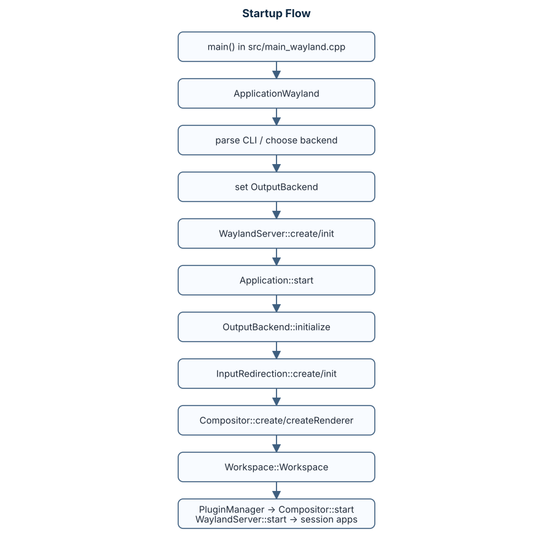
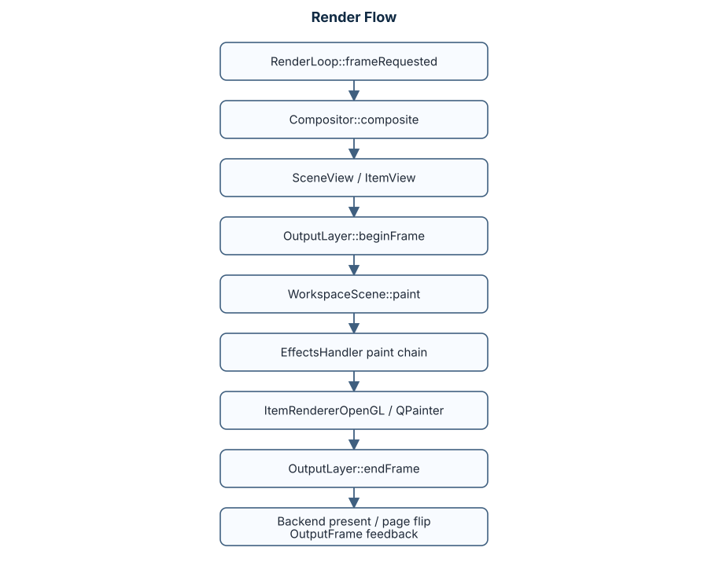
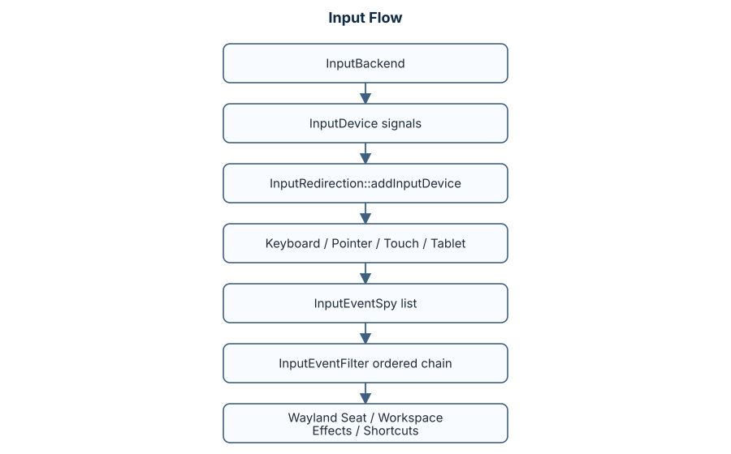
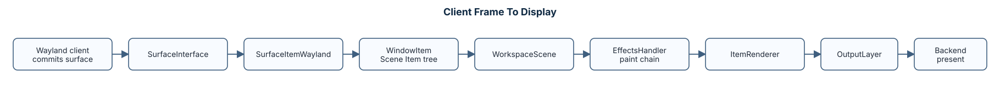
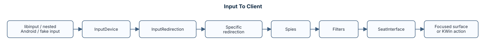
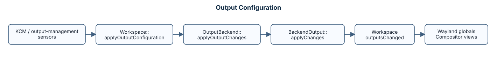

# KWin Architecture Notes

本文基于当前 `Plasma/6.6` 分支源码整理，重点描述代码结构、运行时对象关系和主要数据流。

## 项目定位

KWin 是 KDE Plasma 使用的 Wayland compositor / window manager。当前仓库构建两个核心产物：

- `kwin`：共享库，包含窗口管理、Wayland 协议服务、输入、渲染、插件、脚本等主体逻辑。
- `kwin_wayland`：Wayland 会话入口，可选择 DRM、嵌套 Wayland、嵌套 X11、Virtual 或 Android（Termux）后端启动。

顶层构建入口是 `CMakeLists.txt`，核心源码入口是 `src/CMakeLists.txt`。

## 顶层目录

| 路径 | 作用 |
| --- | --- |
| `src/` | KWin 主实现。 |
| `src/core/` | 后端无关的输出、渲染循环、buffer、色彩、session 抽象。 |
| `src/backends/` | 平台后端：DRM、Wayland、X11 windowed、Virtual、Android、libinput/fakeinput。 |
| `src/scene/` | scene graph、Item 树、渲染视图、OpenGL/QPainter item renderer。 |
| `src/wayland/` | Wayland server protocol wrappers 和协议实现。 |
| `src/xwayland/` | Xwayland 启动、X11 bridge、DND/data bridge、X11 event 接入。 |
| `src/effect/` | Effect API、EffectHandler、效果渲染链。 |
| `src/plugins/` | 内建效果、服务插件、QPA 插件、screencast、nightlight 等扩展。 |
| `src/scripting/` | JS/QML 脚本运行时和暴露给脚本的 Workspace API。 |
| `src/kcms/` | 系统设置模块。 |
| `autotests/` | 单元测试、Wayland server/client 测试、集成测试。 |
| `tests/` | 手工/辅助测试程序。 |
| `doc/` | 用户文档、测试说明、编码约定、色彩管理说明。 |
| `packaging/` | Termux 打包：termux-packages recipe、libepoxy/Xwayland/termux-render 补丁、构建手册。 |
| `tools/` | AHardwareBuffer 客户端验证工具与 QtWayland 客户端 buffer 插件。 |
| `submodule/` | 内嵌的 gl4es、anland、vortek、vulkan-wrapper-android、vulkan-wsi-layer 源码（普通目录，不是 git submodule）。 |

## 核心对象

| 对象 | 文件 | 责任 |
| --- | --- | --- |
| `ApplicationWayland` | `src/main_wayland.*` | 解析命令行，选择输出后端，创建 `WaylandServer`，驱动启动顺序。 |
| `Application` | `src/main.*` | 持有全局配置、`OutputBackend`、`Session`、`PluginManager`、`InputMethod`。 |
| `OutputBackend` | `src/core/outputbackend.h` | 平台后端抽象，创建 input/render backend，暴露物理输出。 |
| `BackendOutput` | `src/core/backendoutput.h` | 后端输出抽象，包含模式、缩放、变换、色彩、亮度、DPMS、render loop。 |
| `LogicalOutput` | `src/core/output.h` | Workspace 使用的逻辑输出，负责全局坐标和输出本地坐标映射。 |
| `RenderLoop` | `src/core/renderloop.h` | 每输出的合成调度器，发出 `frameRequested`，记录 present 时间。 |
| `Compositor` | `src/compositor.*` | 选择 OpenGL/QPainter backend，创建 `WorkspaceScene`，按 render loop 合成。 |
| `RenderBackend` | `src/core/renderbackend.h` | 渲染后端基类，暴露 compatible output layers、buffer import、graphics reset。 |
| `OutputLayer` | `src/core/outputlayer.h` | 输出 plane/layer 抽象，支持 primary、cursor、overlay、direct scanout。 |
| `Workspace` | `src/workspace.*` | 窗口管理中枢：窗口列表、焦点、堆叠、虚拟桌面、输出布局、规则、快捷键。 |
| `Window` | `src/window.*` | 所有可管理窗口的基类，Wayland/X11/Internal window 共享状态和操作。 |
| `WaylandServer` | `src/wayland_server.*` | Wayland display、seat、协议全局对象、surface 到 `Window` 的注册。 |
| `InputRedirection` | `src/input.*` | 输入设备汇聚、事件 spy/filter 链、转发到 seat/window/effects/global shortcuts。 |
| `EffectsHandler` | `src/effect/effecthandler.*` | 效果生命周期、paint hook 链、Effect API 暴露。 |
| `PluginManager` | `src/pluginmanager.*` | 从 `kwin/plugins` 加载二进制插件。 |

## 启动流程



关键顺序在 `ApplicationWayland::performStartup()`：

1. `createOptions()`
2. `outputBackend()->initialize()`
3. `createInput()`
4. `createInputMethod()`
5. `createTabletModeManager()`
6. `Compositor::create(); createRenderer()`
7. `createWorkspace()`
8. `createPlugins()`
9. `compositor->start()`
10. `waylandServer()->start()`
11. 可选启动 Xwayland 和 session/applications

## 后端选择

`kwin_wayland` 当前在 `src/main_wayland.cpp` 根据命令行和环境选择：

- `--android` 或 `KWIN_BACKEND=android`：`AndroidBackend`，详见下文 Android 章节
- `--drm` 或默认无嵌套环境：`DrmBackend`
- `--wayland-display` 或 `WAYLAND_DISPLAY`：`WaylandBackend`
- `--x11-display` 或 `DISPLAY`：`X11WindowedBackend`
- `--virtual`：`VirtualBackend`

后端共同实现 `OutputBackend`：

- `initialize()`：枚举/创建输出。
- `createInputBackend()`：创建 libinput、嵌套 Wayland input、Android input 等。
- `createOpenGLBackend()` / `createQPainterBackend()`：给 compositor 选择渲染实现。
- `outputs()`：提供 `BackendOutput` 列表。
- `supportedCompositors()`：声明 OpenGL/QPainter 支持顺序。

## 渲染架构



主要分层：

- `WorkspaceScene` 持有 scene item tree：container、overlay、cursor、window items。
- `RenderView` 表示对某个 output/layer 的一次视图渲染。
- `Item` 是 scene graph 基类，负责 geometry、visibility、damage、color description。
- `ItemRendererOpenGL` / `ItemRendererQPainter` 是真正绘制 item 的后端无关入口。
- `OutputLayer` 抽象 primary plane、cursor plane、overlay plane，允许 direct scanout 和 overlay assignment。

Compositor 先尝试 OpenGL：

1. `OutputBackend::createOpenGLBackend()`
2. `EglBackend::init()`
3. 检查 driver 推荐和 OpenGL 版本
4. 成功则用 `ItemRendererOpenGL`

失败时尝试 QPainter：

1. `OutputBackend::createQPainterBackend()`
2. 成功则用 `ItemRendererQPainter`

## 输入架构



`InputRedirection` 在构造时调用 `setupInputBackends()`：

- 先取 `kwinApp()->outputBackend()->createInputBackend()`。
- 再添加 `FakeInputBackend`，用于 Wayland fake input 协议。

设备信号接入：

- `InputDevice::keyChanged` -> `KeyboardInputRedirection::processKey`
- pointer motion/button/axis/gesture -> `PointerInputRedirection`
- touch down/up/motion/frame -> `TouchInputRedirection`
- tablet events -> `TabletInputRedirection`

filter 链按权重排序，典型 filter 包含：

- VT 切换
- lockscreen
- screen edge
- DND
- window selector
- tabbox
- global shortcuts
- effects
- move/resize
- popup/decoration/window action
- input method
- forward to clients

## Wayland 协议层

`WaylandServer::init()` 创建协议全局对象，`WaylandServer::initWorkspace()` 在 workspace 建立后接入窗口管理。

核心协议和职责：

- `wl_compositor` / `wl_subcompositor` / `wl_shm`
- `xdg-shell`：普通应用窗口和 popup。
- `wlr-layer-shell`：panel、desktop shell surfaces。
- `plasma-shell` / `plasma-window-management` / virtual desktop management。
- `xdg-decoration` / server decoration / palette。
- `linux-dmabuf` / DRM syncobj / presentation-time。
- input method、text input、keyboard shortcuts inhibit。
- color management、content type、tearing control、fifo、fractional scale。
- screencast、security context、lockscreen overlay 等 Plasma/KWin 扩展。
- `termux_ahardware_buffer_manager_v1`（仅 Android 构建）：客户端 AHardwareBuffer 导入与通道顺序探测。

窗口注册路径：

1. client 创建 surface/shell role。
2. 对应 integration 创建 `Window` 子类。
3. `WaylandServer::registerWindow()` 加入 `m_windows` 并发出信号。
4. `Workspace` 接入窗口管理。
5. `Window::setupCompositing()` 创建/连接 scene item。

## Window 模型

`Window` 是统一窗口抽象，包含：

- frame/client/buffer geometry
- opacity、shape、decoration、shadow
- desktop/activity/output 归属
- focus/activation/minimize/maximize/fullscreen
- stacking、transient、rule、tiling
- scene item 和 effect window 关联

主要子类：

- `WaylandWindow`
- `XdgToplevelWindow`
- `XdgPopupWindow`
- `LayerShellV1Window`
- `X11Window`
- `InternalWindow`
- input panel / PIP 等特殊窗口

`Workspace` 负责全局窗口集合、堆叠序、焦点链、placement、rules、tile manager、输出布局和 DBus 控制。

## Xwayland

`ApplicationWayland` 在 `--xwayland` 时创建 `Xwl::Xwayland`。

主要组成：

- `XwaylandLauncher`：启动 Xwayland 进程，准备 socket、DISPLAY、xauthority、fd 传递。
- `WaylandServer::createXWaylandConnection()`：为 Xwayland 建立 Wayland socket pair。
- `XwaylandInputFilter`：根据 eavesdrop 配置转发部分键鼠事件给 Xwayland。
- `DataBridge` / DND：桥接 X11 与 Wayland selection / drag-and-drop。
- `X11Window`：管理 Xwayland/X11 客户端窗口。

## 插件、效果和脚本

### 二进制插件

`PluginManager` 从 `kwin/plugins` 读取 `KPluginMetaData`，根据 `kwinrc [Plugins]` 和 `EnabledByDefault` 决定加载。

### 内建效果

`src/plugins/CMakeLists.txt` 使用 `kwin_add_builtin_effect()` 注册静态 effect 插件。`kwin_wayland` 通过 `kcoreaddons_target_static_plugins(... NAMESPACE "kwin/effects/plugins")` 链入。

渲染时 `WorkspaceScene` 通过 `EffectsHandler` 调用：

- `prePaintScreen`
- `paintScreen`
- `postPaintScreen`
- `prePaintWindow`
- `paintWindow`
- `drawWindow`

### 脚本

`src/scripting/` 提供 JS/QML 运行时：

- JS 脚本使用 `QJSEngine`。
- QML scene/effect 通过 Quick effect 相关类接入。
- 暴露 `workspace`、`options`、快捷键、screen edge、DBus 调用等 API。

## 配置和 DBus

配置来源：

- `kwinrc`
- `kxkbrc`
- `kcminputrc`
- `kdeglobals`
- KCM 模块写入对应配置。

DBus 适配器在 `src/CMakeLists.txt` 里生成并链接，主要接口：

- `org.kde.KWin`
- `org.kde.kwin.Compositing`
- `org.kde.kwin.Effects`
- `org.kde.KWin.VirtualDesktopManager`
- `org.kde.KWin.Plugins`
- `org.kde.KWin.Session`
- virtual keyboard / tablet mode manager

## Android / Termux 分支改动

### 目标与组成

当前分支让 `kwin_wayland` 以原生 Bionic 进程运行在 Termux 中，通过 termux-app 的 termux-render 模块显示到 Android Surface，并让 KWin 合成与客户端渲染全程走 GPU。核心是一条基于 AHardwareBuffer 的零拷贝链路。相关代码分布：

| 路径 | 作用 |
| --- | --- |
| `src/backends/android/` | `AndroidBackend`、`AndroidOutput`、`AndroidEglBackend`、`AndroidQPainterBackend`，以及安装为 `start-plasma`、`kwin-android-rendering-env`、`kwin-x11-zink`、`kwin-glxgears-test`、`kwin-glxgears-zink-test` 的脚本和调试用 `debug-kwin.sh`。 |
| `src/wayland/androidhardwarebuffer.*`、`src/wayland/protocols/termux-ahardware-buffer-v1.xml` | 私有 Wayland 协议 `termux_ahardware_buffer_manager_v1`，客户端 AHardwareBuffer 导入。 |
| `src/core/`、`src/opengl/`、`src/scene/` | 为 AHardwareBuffer 增加的通用扩展，见"核心 KWin 改动"。 |
| `packaging/` | termux-packages recipe、补丁与构建手册。 |
| `tools/` | AHardwareBuffer 客户端验证工具与 QtWayland 客户端 buffer 插件。 |
| `submodule/` | 内嵌的 gl4es（带 TERMUX_AHB 桥）、anland、vortek、vulkan-wrapper-android、vulkan-wsi-layer 源码。 |

### 后端对象

- `AndroidBackend`（`android_backend.*`）：调用 libtermux-render 的 `setScreenConfig()` / `connectToRender()` 连接 termux-app，取得共享的 `LorieBuffer`（AHardwareBuffer）、`lorie_shared_server_state` 和连接 fd；创建单个 `AndroidOutput` 与虚拟触摸、键盘、指针 `AndroidInputDevice`。输入事件（`EVENT_TOUCH` / `EVENT_MOUSE` / `EVENT_KEY` / `EVENT_UNICODE`）从同一 fd 读取并转成 KWin `InputDevice` 信号。使用 `Session::Type::Noop`，不依赖 VT/DRM session。
- `AndroidOutput`：单输出，模式取自 LorieBuffer 尺寸与 `KWIN_ANDROID_REFRESH_RATE`。QPainter 路径在 `present()` 中 flush；EGL 路径由 `AndroidEglLayer::doEndFrame()` 完成提交。
- `AndroidEglBackend` / `AndroidEglLayer`：GPU 合成，见下文。
- `AndroidQPainterBackend` / `AndroidQPainterLayer`：CPU 回退。`LorieBuffer_lock()` 后把 `QImage` 直接画进共享 buffer。

### 渲染模式选择

`KWIN_ANDROID_GL_MODE` 决定 KWin 使用哪套 GL 实现。脚本 `kwin-android-rendering-env` 的 `kwin_android_select_rendering()` 是唯一的探测与决策点：它探测设备、导出 Mesa/libepoxy/Vulkan 环境，并把 `KWIN_ANDROID_GL_MODE` 归一为 `system`、`zink` 或 `llvmpipe`。C++ 侧 `AndroidEglBackend::renderingModeFromEnvironment()` 只读取该结果：未设置时按默认 `system` 处理并补上 `KWIN_COMPOSE=O2ES`；遇到 `auto`、`turnip` 等未归一的请求值会报错并放弃 EGL 后端，不做二次探测，也不再修改 Mesa 环境变量。context 建立后会对照 `TERMUX_ANDROID_ZINK`、`MESA_LOADER_DRIVER_OVERRIDE` 和实际的 `GL_RENDERER` 输出不匹配警告。

| 模式 | GL 实现 | `KWIN_COMPOSE` | 说明 |
| --- | --- | --- | --- |
| `system` | Android 系统 `/system/lib64/libEGL.so` + GLES 3 | `O2ES` | 默认。模拟器和非 KGSL 设备的可靠路径，不经过 GL 到 Vulkan 翻译。 |
| `zink` / `turnip` / `wrapper` | Termux Mesa Zink，Vulkan ICD 为 Turnip/KGSL、显式 `VK_DRIVER_FILES` 或 vulkan-wrapper-android | `O2` | 脚本用 eglinfo 或 vulkaninfo 做 surfaceless 探测，要求 renderer 报告 zink 且不是软件设备；glibc/Vortek ICD 会被忽略。 |
| `llvmpipe` / `software` | Mesa 软件渲染 | `O2` | 需显式选择。脚本设 `TERMUX_ANDROID_ZINK=1` 让 libepoxy 加载 Termux Mesa，并默认 `LP_NUM_THREADS=4`；`auto` 不再静默降级到此模式。 |
| `auto` | 显式 ICD → Turnip/KGSL 探测 → 系统 GLES → llvmpipe | | 脚本默认值。 |

系统 GLES 与 Mesa 的切换依赖定制 libepoxy：`TERMUX_ANDROID_ZINK=1` 时加载 `$PREFIX/lib/libEGL.so.1` 与 Mesa GLES，否则加载 `/system/lib64/libEGL.so`（补丁见 `packaging/libepoxy-dispatch-system-gles.patch`）。

`system` 模式下 `EglContext::createContext()` 优先申请 GLES 3 context，`EglDisplay::create()` 不再强制要求 `EGL_KHR_no_config_context` / `EGL_KHR_surfaceless_context`，config 通过 `eglChooseConfig()` 显式选取 pbuffer 配置。

### 输出 buffer 零拷贝

`AndroidEglLayer::resolveOutputImport()` 按渲染模式钉死唯一一种输出 buffer 组合，`AndroidEglLayer::setupRenderTarget()` 按此组合建立渲染目标。三种方式互不回退：

| 渲染模式 | 钉定方式 | 路径 |
| --- | --- | --- |
| `system` | `native` | `eglGetNativeClientBufferANDROID()` + `EGL_NATIVE_BUFFER_ANDROID` 创建 EGLImage，直接渲染进 AHardwareBuffer。 |
| `zink` | `dmabuf` | 通过 `LorieBuffer_dupDmaBufFd()` 或 `AHardwareBuffer_getNativeHandle()` 取 dma-buf fd，再走 `EGL_EXT_image_dma_buf_import`。取 native handle 需经 `libtermux-platform-ns.so` 的 `platform_dlopen()` 从系统 linker namespace 加载 `/system/lib64/libandroid.so`。 |
| `llvmpipe` | `readback`（对应 `off`） | 渲染进普通 FBO 纹理，`doEndFrame()` 用 `glReadPixels()` 读到紧密行 staging buffer，再按 AHardwareBuffer 的 stride 逐行拷入 `LorieBuffer_lock()` 映射。 |

`KWIN_ANDROID_AHB_IMPORT` 可显式覆盖为 `native` / `dmabuf` / `off`，用于实验，未设置时取上表钉定值。关键约束：钉定的直接导入（`native` 或 `dmabuf`）失败时直接报错并让本帧 setup 失败，不会隐式改用另一种导入，也不会静默降级到 CPU readback；只有明确选择 `off`（即 llvmpipe）时才走 readback。这样出问题时日志直接显示哪种组合失败，无需猜测实际运行的是哪一种。

渲染目标使用 `RenderTarget(fbo, OutputTransform::FlipY)`，因为 GL 是左下角原点而 termux-render 按 Android 左上角采样。每帧结束时直接渲染路径先 `glFinish()`，再取 `lorie_shared_server_state` 的进程共享 mutex，置 `drawRequested`、清 `waitForNextFrame` 并 `pthread_cond_signal(rendererCond)` 唤醒 termux-app 消费端。当前为单缓冲，没有 fence 传递。

### 客户端 AHardwareBuffer 协议

`KWIN_BUILD_ANDROID_AHARDWAREBUFFER`（Android 构建默认 ON）编译 `src/wayland/androidhardwarebuffer.cpp`。`WaylandServer::init()` 注册 `AndroidHardwareBufferManagerV1`，`Display::bufferForResource()` 识别 `AndroidHardwareClientBuffer`。

协议 `termux_ahardware_buffer_manager_v1`（version 2）：

- `create_buffer(id, socket, flags)`：客户端先用 `AHardwareBuffer_sendHandleToUnixSocket()` 把 buffer 发到 socket，KWin 用 `AHardwareBuffer_recvHandleFromUnixSocket()` 接收，检查尺寸、layers 与 `GPU_SAMPLED_IMAGE` usage，包装为 `AndroidHardwareClientBuffer`（`GraphicsBuffer` 子类，实现新增的 `androidHardwareBufferAttributes()`）。`flags` 位：`opaque`（忽略 alpha）、`swap_red_blue`（采样时交换 R/B）。
- `probe_buffer(socket, token)` / `probe_result(token, channel_order)`（since 2）：客户端把渲染成纯红色的 buffer 发来，KWin 在真实合成 context 中用 `probeChannelOrder()` 采样 1x1 像素，回复 `identity` 或 `swap_red_blue`，客户端据此设置后续 buffer 的 flags。这解决了不同设备与驱动之间 BGRA 通道顺序不一致的问题。
- 版本 1 为隐式同步：生产者 attach 前必须完成 GPU 写入，`wl_buffer.release` 表示合成器不再读取。

纹理导入由 `KWIN_ANDROID_CLIENT_BUFFER_IMPORT` 控制。`native`（默认）在 `EglBackend::importBufferAsImage()` 中直接用 `EGL_NATIVE_BUFFER_ANDROID` 建 EGLImage；`dmabuf` 在 `AndroidHardwareClientBuffer` 构造时导出 dma-buf fd 填充 `DmaBufAttributes`，之后走 KWin 原有 dmabuf 路径。`OpenGLSurfaceTexture` 新增 `AndroidHardwareBuffer` buffer 类型，并把 `needsRedBlueSwap()` / `needsForceOpaque()` 传给 `ItemRendererOpenGL`，对应 `ShaderTrait::SwapRedBlue` / `ShaderTrait::ForceOpaque`，由 `GLShaderManager` 在片元着色器里生成 `result = result.bgra` 与 `result.a = 1.0`。

### 客户端生态

- **Xwayland**：`packaging/xwayland-ahardwarebuffer-glamor.patch` 新增 `hw/xwayland/xwayland-glamor-ahb.c`。注册表中发现该协议时，glamor 使用 AHardwareBuffer 后端而非 GBM：用系统 EGL 渲染进 AHB 支持的 pixmap，经 `create_buffer` 交给 KWin，并使用 `probe_buffer` 自动确定通道顺序。同时接受一种特殊 DRI3 `PixmapFromBuffer`，其 fd 是承载 AHB handle 的 Unix socket。
- **gl4es**（`submodule/gl4es`，`-DTERMUX_AHB=ON`）：X11 OpenGL/GLX 程序经 gl4es 翻译到系统 GLES，`src/glx/termux_ahb_bridge.c` 把渲染结果放进 AHB，通过上述 DRI3 桥交给 Xwayland。`kwin-glxgears-test` 用它验证；`kwin-glxgears-zink-test` 则让 GLX 客户端自身走 Mesa Zink。
- **原生 Qt 应用**：`tools/termux-qt-ahb-plugin/` 是 QtWayland client buffer 插件，三缓冲 AHB swapchain，`qt-system-gles-run` 启动器为其选择系统 EGL。
- **验证工具**：`tools/termux-ahb-test/ahb-wayland-test.c`（原生 Wayland 客户端 smoke test）、`tools/ahb-dri3-egl-demo.c`（Xwayland DRI3 桥验证）。

### 数据流

X11 OpenGL 客户端的完整零拷贝链路：

```text
X11 应用 → gl4es → 系统 GLES → AHardwareBuffer → DRI3 socket → Xwayland glamor-ahb
  → termux_ahardware_buffer_manager_v1 → KWin EGLImage/纹理 → 合成进输出 AHardwareBuffer
  → termux-render 消费端 → Android Surface
```

原生 Wayland 客户端省去 gl4es 与 Xwayland 两级，直接通过协议把 AHardwareBuffer 交给 KWin。

### 核心 KWin 改动

- `core/graphicsbuffer.*`：新增 `AndroidHardwareBufferAttributes` 与虚函数 `androidHardwareBufferAttributes()`。
- `core/rendertarget.*`：新增带 `OutputTransform` 的 `RenderTarget(GLFramebuffer *, transform)` 构造。
- `opengl/egldisplay.*`：`EglDisplay::create()` 增加 `requireConfiglessSurfaceless` 参数。
- `opengl/eglcontext.cpp`：`system` 模式优先 GLES 3 context；GLES 3.0 视为支持 unpack subimage。
- `opengl/eglbackend.cpp`：`importBufferAsImage()` / `testImportBuffer()` 支持 AHardwareBuffer。
- `opengl/glshadermanager.*`：新增 `SwapRedBlue`、`ForceOpaque` shader trait。
- `scene/surfaceitem.*`、`scene/itemrenderer_opengl.cpp`：AHardwareBuffer 纹理类型与 trait 传递。
- `wayland/display.cpp`、`wayland_server.cpp`：协议注册与 buffer 识别。
- `compositor.cpp`：崩溃信息收集对没有 DRM 设备的后端做空指针保护。
- `main_wayland.cpp`：`--android` / `KWIN_BACKEND=android`；Android 后端默认 socket 名取 `KWIN_WAYLAND_SOCKET`，否则为 `wayland-1`。

### 构建与打包

- `src/backends/CMakeLists.txt` 无条件 `add_subdirectory(android)`；`src/backends/android/CMakeLists.txt` 通过 pkg-config 依赖 `termux-render`，因此当前树只能在提供 termux-render 的 Termux 环境构建。
- 五个包（libepoxy、gl4es、xwayland、kwin、termux-render）的 recipe 与补丁在 `packaging/`，完整步骤见 `packaging/TERMUX_AHB_BUILD_GUIDE.md`。
- termux-render 源码来自 termux-app 的 `termux-render` 模块，同一份代码同时构建 Android 消费端与 Termux 客户端库 `libtermux-render.so`。

### 启动流程（start-plasma）

1. 建立持久化运行目录 `~/.termux/kwin-runtime`（`TMPDIR`、`XDG_RUNTIME_DIR`、日志、`session.env`），避免 TermuxService 清理 `$PREFIX/tmp`；把 `$PREFIX/tmp/.X11-unix` 链接到该目录。
2. 会话锁与已运行检测。
3. source `kwin-android-rendering-env`，`kwin_android_select_rendering()` 设定 GL 模式和三项导入选择。
4. 启动 D-Bus，运行 `kwin_wayland --socket ... --xwayland --no-global-shortcuts`，等待 Wayland socket 与日志中的 "Android EGL backend initialized"。
5. 发现 Xwayland socket 并导出 `DISPLAY`，写入 `session.env`，再启动 kdeinit、kded、kactivitymanagerd、plasmashell。
6. `--debug-rendering` 打开 `kwin.android.egl` 逐帧 debug 日志；`--test-xwayland` 运行 xdpyinfo、glxinfo、glxgears 自检。

### 环境变量速查

| 变量 | 作用 |
| --- | --- |
| `KWIN_ANDROID_GL_MODE` | 脚本输入：`auto` / `system` / `zink` / `turnip` / `wrapper` / `llvmpipe` 等；脚本归一后只剩 `system` / `zink` / `llvmpipe`，KWin 只接受这三个值。 |
| `KWIN_ANDROID_AHB_IMPORT` | 输出 buffer 导入覆盖：`native` / `dmabuf` / `off`；未设置时由渲染模式钉定（system→native、zink→dmabuf、llvmpipe→off），三者互不回退。 |
| `KWIN_ANDROID_CLIENT_BUFFER_IMPORT` | 客户端 buffer 导入：`native` / `dmabuf`。 |
| `TERMUX_RENDER_AHB_RECEIVE` | termux-render 接收输出句柄方式：`native`（还原完整 AHardwareBuffer）/ `dmabuf`（只保留 dma-buf fd）。 |
| `TERMUX_ANDROID_ZINK` | libepoxy 选择 Mesa（`1`）或系统 EGL/GLES（未设置或 `0`）。 |
| `KWIN_ANDROID_ENABLE_EGL` | 未设置或 `0` 时跳过 EGL 后端，直接用 QPainter；脚本设为 `1`。 |
| `KWIN_ANDROID_BUFFER_TYPE` | 向 termux-render 请求的 LorieBuffer 类型：`ahb` 或 `fd`；未设置时为 `fd`，脚本设为 `ahb`。 |
| `KWIN_ANDROID_WIDTH` / `KWIN_ANDROID_HEIGHT` / `KWIN_ANDROID_REFRESH_RATE` | 请求的屏幕配置。 |
| `KWIN_ANDROID_KEYCODE_MODE` | 键码映射：`evdev`（默认）或 `android`。 |
| `KWIN_ANDROID_DISABLE_INPUT` | `1` 时不创建虚拟输入设备。 |
| `KWIN_ANDROID_DEBUG` | 打开 `kwin.android.egl` 逐帧 debug 日志。 |
| `VK_DRIVER_FILES`、`KWIN_ANDROID_TURNIP_ICD`、`KWIN_ANDROID_KGSL_DEVICE`、`KWIN_ANDROID_WRAPPER_ICD`、`KWIN_ANDROID_WRAPPER_LIBRARY`、`KWIN_ANDROID_AUTO_PREFER_WRAPPER` | Zink 路径的 ICD、设备节点与 wrapper 覆盖。 |
| `KWIN_ANDROID_DISABLE_RENDERER_PROBE`、`KWIN_ANDROID_PROBE_TIMEOUT` | 脚本侧 eglinfo / vulkaninfo 探测控制。 |
| `KWIN_ANDROID_RUNTIME_ROOT`、`KWIN_ANDROID_TMPDIR`、`KWIN_ANDROID_XDG_RUNTIME_DIR`、`KWIN_ANDROID_SESSION_ENV` | start-plasma 的运行目录覆盖。 |

### 已知限制

- 输出 buffer 为单缓冲，帧末 `glFinish()` 串行等待 GPU；termux-render 尚无 native fence 传递。`submodule/anland` 的 V2 协议带 fence 通道，是候选替代方案。
- `AndroidEglLayer::doBeginFrame()` 每帧全屏重绘，未利用 damage 跟踪。
- 客户端 dma-buf 导出假设 32bpp 单平面格式（`R8G8B8A8` / `R8G8B8X8` / `B8G8R8A8`）。
- 每种渲染模式钉死一种完整的 buffer 组合，任何一环失败都直接报错而非切换组合；软件渲染只能通过 `KWIN_ANDROID_GL_MODE=llvmpipe` 显式启用，`auto` 不再兜底到 llvmpipe。

## 测试结构

- `doc/TESTING.md`：官方测试运行说明。
- `autotests/`：单元测试、effect 测试、Wayland client/server 测试、libinput 测试、DRM mock 测试。
- `autotests/integration/`：用 `dbus-run-session` 启动 KWin 集成测试，覆盖输入、窗口规则、输出变化、scene、Xwayland、screencast、DRM 等。
- `tests/`：手工测试客户端和辅助测试程序。
- `tools/termux-ahb-test/`、`tools/ahb-dri3-egl-demo.c`、`kwin-glxgears-test`、`kwin-glxgears-zink-test`、`start-plasma --test-xwayland`：Android AHardwareBuffer 链路的手工验证。

常规验证路径：

```bash
cd <build-dir>
dbus-run-session xvfb-run ctest
```

集成测试函数在 `autotests/integration/CMakeLists.txt` 中定义为 `integrationTest()`。

## 主要数据流

### Client frame 到显示



### 输入到 client



### 输出配置



## 修改入口建议

| 目标 | 优先查看 |
| --- | --- |
| 新增平台后端 | `src/core/outputbackend.h`, `src/backends/*`, `src/main_wayland.cpp` |
| 新增渲染路径 | `src/core/renderbackend.h`, `src/core/outputlayer.h`, `src/compositor.cpp`, `src/scene/` |
| 新增 Wayland 协议 | `src/wayland/CMakeLists.txt`, `src/wayland_server.cpp`, `src/wayland/*` |
| 调整窗口管理 | `src/workspace.*`, `src/window.*`, 对应 `*window.*` 子类 |
| 调整输入 | `src/input.*`, `src/keyboard_input.*`, `src/pointer_input.*`, `src/touch_input.*`, `src/backends/*` |
| 新增效果 | `src/effect/`, `src/plugins/`, `src/plugins/CMakeLists.txt` |
| 新增 KCM | `src/kcms/` |
| 调试 Xwayland | `src/xwayland/`, `src/x11window.*`, `src/events.cpp` |
| Android 输出后端 / 输出零拷贝 | `src/backends/android/android_egl_backend.cpp`, `src/backends/android/android_backend.cpp`, `src/backends/android/android-rendering-env.sh` |
| 客户端 AHardwareBuffer 导入 | `src/wayland/androidhardwarebuffer.cpp`, `src/wayland/protocols/termux-ahardware-buffer-v1.xml`, `src/opengl/eglbackend.cpp`, `src/scene/surfaceitem.cpp` |
| Termux 启动与打包 | `src/backends/android/start-plasma.sh`, `packaging/TERMUX_AHB_BUILD_GUIDE.md`, `packaging/` |
